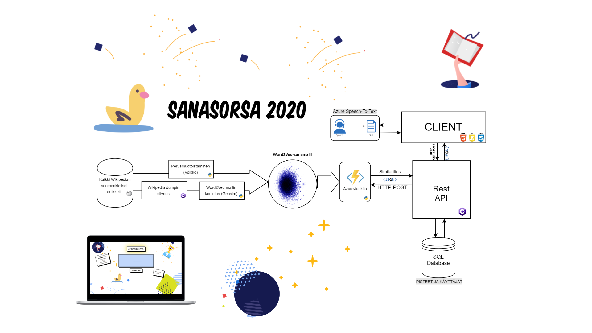
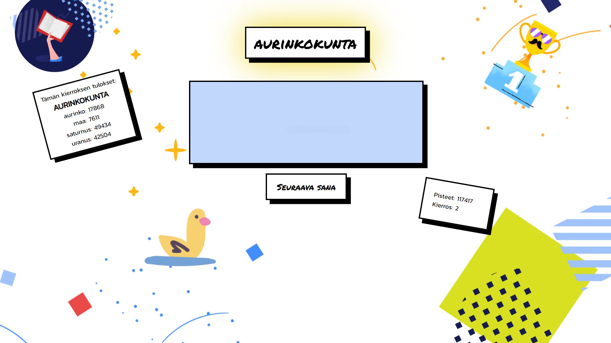

# Sanasorsa 2020 :duck:

Sanasorsa 2020 is a small browser-based word game created as the final project for the C#.NET / Azure course of Academy Finland in 2019. The game utilises a machine learning model (Word2Vec) trained with Finnish Wikipedia articles to give scores to the player.

## Architecture

All the components of the game were designed to run on Azure. This repository contains the code for the backend REST-API and the static HTML/JavaScript pages for the frontend. The Word2Vec model trained by the machine learning algorithms runs as a separate Azure Function and handles querying the model for distances between vectors and scoring the player's guesses. The function is called by the backend REST API written in C# instead of being called directly by the application frontend.

## Gameplay

The game is voice controlled and can be played without using the keyboard. Alternatively, the player can write their guesses into the text box. The goal of the game is to list as many words related to the word provided by the game in 10 seconds. After three rounds, the player can choose to enter their score to be included in the leaderboard or they can start again without saving their scores.

[You can play the live version of the game here.](https://sanasorsa.azurewebsites.net/ "Play Sanasorsa 2020") 

For the voice control to work, you need to open the game through an HTTPS link. As the site is for proof-of-concept demo use only, tallying the scores might take some 30 s - 1 min to be completed during the first round as the Azure function will have to perform a cold start.

[Watch the gameplay video here.](http://www.youtube.com/watch?v=vCN54GZkiyo "Sanasorsa 2020 Gameplay")

## Related Repositories

We worked on different parts of the software as separate projects. This repository contains for the REST API and application frontend. 

The code for the Word2Vec Azure Function can be found in [this repository](https://github.com/greyrainyskies/Sanasorsa2020-Function).

The material cleaning scripts and model training scripts are yet to be updated and published.

## Collaborators

This project was made with :heart: by [Johanna](https://github.com/johnur), [Saska](https://github.com/SaskaYl), [Urho](https://github.com/unie31) and [Ville](https://github.com/greyrainyskies)
